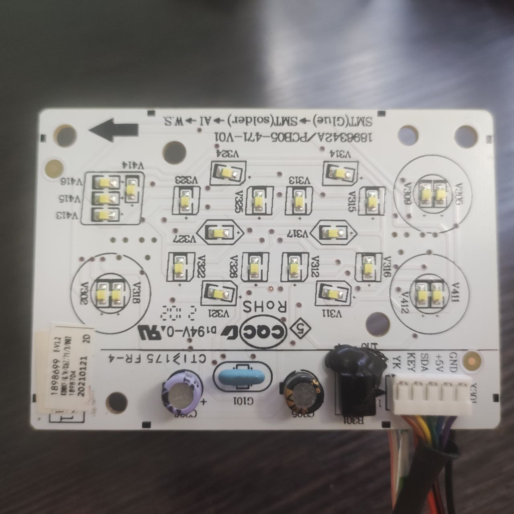

# hisense_acu2d

HiSense_acu2d - проект по подключения WIFI модуля на базе ESP8266 (ESP-01, ESP12-F) к кондиционерам производства Hisense, в которых отсутствует заводская возможность подключения Wifi молулей.
Существуют реализации управления кондиционером через IR [esphome-whirlpool-ac](https://github.com/d1mdev/esphome-whirlpool-ac) и в стандартной библиотеке [esphome.io/components/climate](https://esphome.io/components/climate/climate_ir.html#whirlpool) однако у них всех есть недостаток - отутствие четкой обратной связи, текущего состояния кондиционера. В этом копаненте для получения 'точного состояния'/'обратной связи' используются данные, которые передаются от базового блока управления кондиционера к экранному модулю. Все проверки проводились на кондиционере Ballu [BSAG-12HN1_20Y](https://www.ballu.ru/catalog/tekhnika_dlya_doma_i_ofisa/konditsionery_vozdukha/on_off_split_sistemy/seriya_i_green_pro/split_sistema_ballu_bsag_12hn1_20y_komplekt/)

## Возможности

Реализованы базовые возможности управления:
- Включение/выключение
- Уставнока режимов работы - Охлаждение, Нагрев, Вентиляция, Осушение
- Уставновка целевой температуры
- Отображение температуры со встроенного датчика
- Управление скоростью и режимом работы вентилятора
- Управление горизонтальной и вертикальной работой жалюзи/шторкой

## Оборудование

При разработке использовался [модуль](https://github.com/dudanov/iot-uni-dongle)

Базовый / основной блок кондиционера имеет маркировку [PCB05-404-V02](https://www.google.com/search?q=PCB05-404-V02&oq=PCB05-404-V02), [1553856](https://www.google.com/search?q=1553856&oq=1553856)

Экранный модуль имеет маркировку [PCB05-471-V01](https://www.google.com/search?q=PCB05-471-V01), [1896342A](https://www.google.com/search?q=1896342A)

## Подключение

Общий вид экранного модуля

<details>
<summary> Развернуть </summary>



</details>

Подключение к обратной стороне дисплея выполнено пайкой к разъему


Подключение модуля к кондиционеру. Это первоначальная фотография. 


> [!NOTE]
> **Дополнительно к модулю нужно соединить розовый провод от кондиционера "YK" к площадке "IR"**

## Общий вид в кондиционере

<details>
<summary> Развернуть </summary>


</details>

## Пример минимальной конфигуции ESPHome

```
# Enable logging, если нужен
logger:
  # Только на сетевом интерфейсе, вывод  в web консоль
  # UART используется для взаимодействия с кондиционером
  baud_rate: 0

external_components:
  - source: github://Anat0l/hisense_acu2d
    components: [ hisense_acu2d ]
    refresh: 0s

# Настройка UART
uart:
  tx_pin: GPIO1
  rx_pin: GPIO3
  baud_rate: 1200

# Передатчик
remote_transmitter:
  id: "acu2d_transmitter"
  pin: 
    number: GPIO13
    inverted: False
  carrier_duty_percent: 100%

climate:
  - platform: hisense_acu2d
    id: hisense_acu2d_climate
    name: "Кондиционер"
    transmitter_id: "acu2d_transmitter"
    visual:
      min_temperature: 16
      max_temperature: 30
      temperature_step: 1.0
    supported_swing_modes:
      - 'OFF'
      - VERTICAL
      - HORIZONTAL
      - BOTH
```

## Отказ от ответственности

> [!CAUTION]
> Все что вы делаете, вы делаете на свой страх и риск.
> 
> Данные материалы предоставляются как есть.
> 
> Автор не несет никакой ответственности за возможные риски связаные с выходом из строя оборудования, приченению вреда здоровью и имуществу.
> 
> **Я не являюсь программистом и скорей всего в коде присутствуют какие-то ошибки.**
> 
 
## Ссылки

Проект основан на с использование компанент ESPHome:

[esphome-whirlpool-ac](https://github.com/d1mdev/esphome-whirlpool-ac) и [ESPHaier](https://github.com/MiguelAngelLV/esphaier/tree/master)

## Благодарности

[Sergey Dudanov](https://github.com/dudanov) за разработку WiFi модуля

